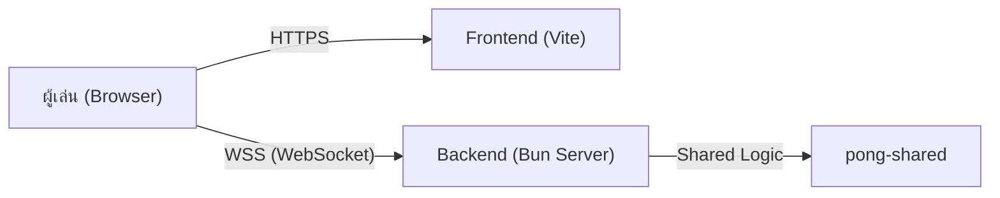

# 🚀 คู่มือการ Deploy โปรเจกต์ Pong (Deployment Guide)

เนื่องจากโปรเจกต์นี้เป็นโครงสร้าง **Monorepo** และมีการใช้งาน **WebSockets** ฝั่ง Backend การเลือกบริการที่เหมาะสมจึงมีความสำคัญมากเพื่อให้ระบบ Real-time ทำงานได้อย่างมีประสิทธิภาพ

---

## 🏗 ภาพรวมสถาปัตยกรรมที่แนะนำ

เราแนะนำให้แยกการ Deploy ออกเป็น 2 ส่วนหลัก:
1.  **Frontend (`pong-fe`)**: Deploy บนบริการ Static Hosting (Vercel, Netlify)
2.  **Backend (`pong-be`)**: Deploy บนบริการที่รองรับ Persistent Process หรือ Container (Railway, Render, Fly.io) **เนื่องจาก Vercel Serverless ไม่รองรับ Native WebSockets**

---

## 1. การ Deploy บน Railway (แนะนำสำหรับ Backend)

Railway เหมาะมากสำหรับโปรเจกต์ Monorepo และรองรับ WebSocket โดยตรง

### ขั้นตอนการตั้งค่า:
1.  **เชื่อมต่อ GitHub**: เลือก Repository ของคุณ
2.  **ตั้งค่า Root Directory**: ในเมนู Settings ของ Railway ให้ระบุ `Root Directory` เป็น `/` (หรือปล่อยว่าง)
3.  **Command ในการ Build & Start**:
    *   **Backend Service**: 
        *   Build Command: `bun install`
        *   Start Command: `bun run start:be` (หรือตามที่ระบุใน `package.json`)
    *   **Environment Variables**: ระบุ `PORT` (Railway จะกำหนดให้เอง) และ `NODE_ENV=production`. ดูตัวอย่างได้ที่ `pong-be/.env.example`

> [!IMPORTANT]
> **ทำไมต้อง Railway?**: เนื่องจากเกมเราใช้ WebSockets ที่ต้องการการเชื่อมต่อค้างไว้ตลอดเวลา (Persistent Connection) บริการอย่าง Railway หรือ Render ที่รันเซิร์ฟเวอร์แบบตลอดเวลาจะเสถียรกว่า Serverless

---

## 2. การ Deploy บน Vercel (เหมาะสำหรับ Frontend)

Vercel รองรับ Monorepo ได้ดีมากผ่านระบบ "Project Linking"

### ขั้นตอนการตั้งค่า:
1.  **New Project**: เลือก Repo เดียวกัน
2.  **Framework Preset**: เลือก `Vite`
3.  **Root Directory**: เลือกโฟลเดอร์ `pong-fe`
4.  **Environment Variables**:
    *   `VITE_WS_SERVER_URL`: ระบุ URL ของ Backend ที่ Deploy บน Railway แล้ว (เช่น `wss://your-be.railway.app`) ดูตัวอย่างได้ที่ `pong-fe/.env.example`

---

## 3. บริการทางเลือกอื่น ๆ

| Service | เหมาะสำหรับ | ข้อดี |
| :--- | :--- | :--- |
| **Railway** | FE + BE | ใช้งานง่ายที่สุดสำหรับ Monorepo รองรับ WebSocket ดีเยี่ยม |
| **Render** | BE (Web Service) | มีระบบ Auto-deploy จาก GitHub และรองรับ WebSocket |
| **Fly.io** | BE (Container) | Deploy ใกล้ตัวผู้เล่น (Edge) ช่วยลดค่า Ping ได้ดีมาก |
| **DigitalOcean** | FE + BE | สำหรับคนต้องการควบคุมเซิร์ฟเวอร์ (VPS) เองทั้งหมด |

---

## 🚀 Option 4: Full Railway Deployment (ทั้ง FE และ BE)

คุณสามารถรันทั้งสองส่วนบน Railway ได้ภายใน Project เดียวกัน ซึ่งจะช่วยให้การจัดการง่ายขึ้น (จัดการบิลและตัวแปรที่เดียว)

### ขั้นตอนการตั้งค่า:

1.  **สร้าง 2 บริการ (Services) ใน Railway Project เดียวกัน**:
    - เชื่อมต่อ GitHub Repo เดิม 2 ครั้ง เพื่อสร้าง 2 กล่อง (Service)
2.  **ตั้งค่าบริการ Backend (`pong-be`)**:
    - **Root Directory**: ให้ปล่อยว่างเป็น `/` (เพื่อให้เห็น `pong-shared`)
    - **Build Command**: `bun install`
    - **Start Command**: `bun run --cwd pong-be start`
    - **ENV**: ตั้งค่า `PORT` และ `VITE_ALLOWED_ORIGINS` (ใส่ URL ของ FE ที่จะได้จาก Railway)
3.  **ตั้งค่าบริการ Frontend (`pong-fe`)**:
    - **Root Directory**: ระบุเป็น `/` (เพื่อให้เห็น `pong-shared` ตอน Build)
    - **Build Command**: `bun install && bun run --cwd pong-fe build`
    - **Start Command**: `bun run --cwd pong-fe preview --port $PORT --host` (หรือใช้ Static Web Server)
    - **ENV**: ตั้งค่า `VITE_WS_SERVER_URL` (ใส่ URL ของ BE ที่ได้จาก Railway)

> [!TIP]
> **ทำไมต้อง Root Directory เป็น `/` เสมอ?**: ในโครงสร้าง Monorepo ของเรา ทั้ง FE และ BE ต้องใช้ไฟล์จาก `pong-shared` หากเราตั้ง Root เป็นโฟลเดอร์ย่อย Railway จะมองไม่เห็นโฟลเดอร์ Shared ที่อยู่ข้างนอกครับ

---

## 📦 การจัดการ `pong-shared` ใน Monorepo

`pong-shared` เป็นหัวใจสำคัญที่ Frontend และ Backend ต้องใช้ร่วมกัน ในการ Deploy เรามีวิธีจัดการดังนี้:

### 1. การ Build บน Railway (Backend)
Railway จะต้องมองเห็นทั้ง Repo เพื่อให้ `bun install` สามารถสร้าง Symbolic Links ไปยัง `pong-shared` ได้:
- **Root Directory**: ให้ตั้งเป็น `/` (Root ของทัังโปรเจกต์)
- **Install Command**: `bun install` (รันที่ Root เพื่อติดตั้งทุก Workspace)
- **Build/Start Command**: `bun run --cwd pong-be start` (สั่งรันจาก Root โดยชี้ไปที่ folder backend)

### 2. การ Build บน Vercel (Frontend)
Vercel รองรับระบบ Monorepo โดยอัตโนมัติ:
- **Root Directory**: ระบุเป็น `pong-fe`
- **Settings**: Vercel จะตรวจพบว่าเป็น Monorepo และจะพยายามเดินย้อนกลับไปที่ root เพื่อหา `bun.lockb` และ `pong-shared` ให้เองโดยอัตโนมัติในตอน Build

---

## ⚠️ ข้อควรระวังสำหรับ Monorepo

1.  **Shared Workspace**: หาก Backend ต้องใช้โค้ดจาก `pong-shared` คุณต้องแน่ใจว่า Build Step มีการเรียก `bun install` จากระดับ Root ของโปรเจกต์เพื่อให้ Workspace ทำงานได้ถูกต้อง
2.  **CORS**: เมื่อแยก Domain ระหว่าง FE และ BE อย่าลืมตั้งค่า CORS ใน Backend ให้รองรับ Domain ของ Frontend ด้วย
3.  **Mixed Content**: หาก Frontend เป็น `https://` เซิร์ฟเวอร์ Backend ต้องรองรับ `wss://` (SSL) เสมอ (Railway จัดการให้ฟรี)

---

### แผนผังการเชื่อมต่อ (Production Flow)

