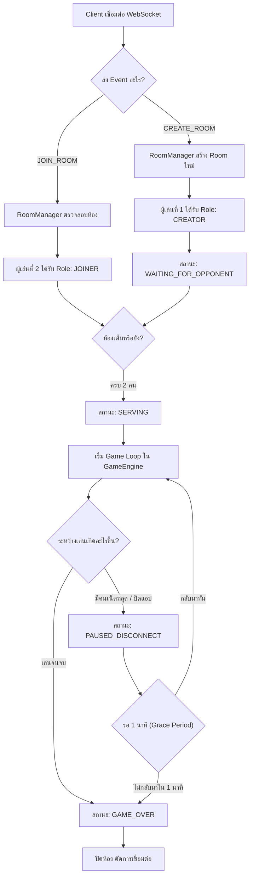
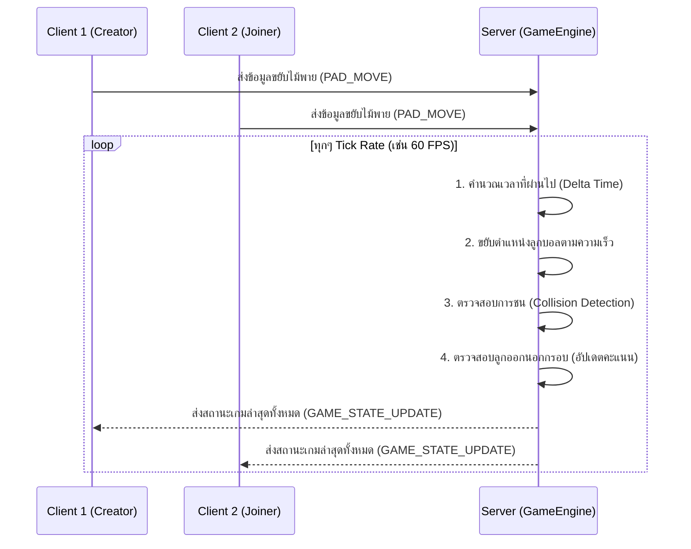

# คู่มือทำความเข้าใจระบบ Backend (Multiplayer Game) - Pong

เอกสารนี้จัดทำขึ้นเพื่อให้ผู้เริ่มต้น (Newbie) หรือผู้ที่เพิ่งศึกษาระบบเกมแบบ Multiplayer สามารถเข้าใจภาพรวมและสถาปัตยกรรมของแอปพลิเคชัน Backend (`pong-be`) ได้ง่ายขึ้น ก่อนที่จะลงไปดูรายละเอียดในซอร์สโค้ด

---

## 1. ภาพรวมสถาปัตยกรรม (Architecture Overview)

ระบบ Backend ของเกม Pong ใช้ **WebSocket** ในการสื่อสารแบบ Real-time (สื่อสารได้สองทางตลอดเวลาโดยไม่ต้องรอ Request/Response แบบ HTTP) โครงสร้างหลักๆ ถูกแบ่งออกเป็น 4 ส่วนดังนี้:

1. **`WebSocketServer`**: จุดรับการเชื่อมต่อจากผู้เล่น (Client) ทำหน้าที่คัดกรองข้อความที่ส่งมา และส่งต่อไปให้ระบบจัดการห้อง
2. **`RoomManager`**: ระบบศูนย์กลางที่จัดการ "ห้องเล่นเกม" (Room) ทั้งหมด คอยดูแลการสร้างห้อง, การเข้าร่วมห้อง, และการจัดการเมื่อมีคนหลุด (Disconnect)
3. **`Room`**: ตัวแทนของ "ห้องเกม 1 ห้อง" เก็บข้อมูลสถานะของเกม (Game State) และข้อมูลผู้เล่น 2 คน (Creator & Joiner)
4. **`GameEngine`**: หัวใจหลักของเกมที่ทำงานเป็น **Game Loop** คอยคำนวณฟิสิกส์ (การเคลื่อนที่ของลูกบอล, การชนไม้พาย, การนับคะแนน)

---

## 2. วงจรชีวิตของเกม (Room Lifecycle)

การทำงานของเกมตั้งแต่เริ่มต้นจนจบ สามารถอธิบายได้ตามแผนภาพด้านล่าง:

---

## 3. การทำงานของ Game Loop (Game Engine)

ในเกม Multiplayer จะมีสิ่งที่เรียกว่า **Tick Rate** หรือวงรอบการทำงานของเซิร์ฟเวอร์ (เช่น ทำงาน 60 ครั้งต่อวินาที)
ในไฟล์ `GameEngine.ts` จะมีฟังก์ชัน `tick()` ที่ถูกเรียกซ้ำๆ ตลอดเวลาเพื่อคำนวณตำแหน่งและส่งผลลัพธ์ไปให้ผู้เล่นทั้งสองคน

### คอนเซปต์สำคัญใน Game Loop:
- **Server is the Boss (Authoritative Server)**: Client ไม่ได้คำนวณฟิสิกส์เอง หน้าที่ของ Client คือส่ง "คำสั่ง" (เช่น ขยับซ้าย/ขวา, กดปุ่มเสิร์ฟ) ไปหา Server เท่านั้น Server จะเป็นคนตัดสินว่าลูกบอลอยู่ตรงไหน และส่ง State กลับไปให้ Client วาดภาพตาม
- **Continuous Collision Detection (CCD)**: ใน `GameEngine.ts` มีการคำนวณการชนแบบละเอียด แทนที่จะเช็คแค่การทับซ้อนกัน ระบบจะคำนวณเวลาและจุดตัดล่วงหน้า เพื่อป้องกันปัญหา "ลูกบอลวิ่งทะลุไม้พาย" เมื่อลูกบอลมีความเร็วสูงเกินไป

---

## 4. สถานะต่างๆ ของเกม (Game Phases)

สถานะของเกม (`GamePhase`) จะเป็นตัวควบคุมว่าใน Tick นั้นๆ Game Loop ต้องทำอะไร:
1. `WAITING_FOR_OPPONENT` : รอคนเข้ามาจอย ห้องยังไม่ทำงาน
2. `SERVING` : โหมดเตรียมเสิร์ฟ ลูกบอลจะลอยติดอยู่กับไม้พายของคนที่มีสิทธิ์เสิร์ฟ (ฟิสิกส์ลูกบอลยังไม่ทำงาน)
3. `PLAYING` : เกมกำลังดำเนินอยู่ ลูกบอลวิ่งไปมาตามปกติ
4. `PAUSED_DISCONNECT` : ผู้เล่นคนใดคนหนึ่งหลุด เกมจะหยุดชั่วคราวเพื่อรอให้กด Reconnect กลับมา
5. `GAME_OVER` : เกมจบแล้ว สรุปผลแพ้ชนะ

---

## 5. คำแนะนำในการอ่านโค้ดสำหรับผู้เริ่มต้น

หากต้องการไล่ดูโค้ดให้เข้าใจง่าย แนะนำให้อ่านตามลำดับนี้:
1. เริ่มที่ **`src/features/network/WebSocketServer.ts`** 
   - ดูว่าเมื่อ Client ส่งข้อความมา (เช่น `CREATE_ROOM`, `JOIN_ROOM`) มันวิ่งไปที่ฟังก์ชันไหน
2. ไปที่ **`src/features/matchmaking/RoomManager.ts`** 
   - ดูระบบจัดการห้อง การสร้าง/การเข้าร่วม และระบบ Grace Period เมื่อมีคนหลุด (1 นาที)
3. ไปที่ **`src/features/matchmaking/Room.ts`** 
   - ดูว่าโครงสร้างข้อมูลใน 1 ห้องเก็บสถานะ (Game State) อะไรไว้บ้าง และมีตัวแปรอะไรบ้าง
4. จบที่ **`src/features/game/GameEngine.ts`** 
   - (ส่วนนี้ซับซ้อนสุด) เข้าไปดูฟังก์ชัน `tick()` เพื่อดูการคำนวณฟิสิกส์, การสะท้อนของลูกบอล (`resolvePadBounce`), และลอจิกการให้คะแนน (`scorePoint`)
