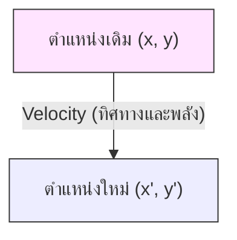
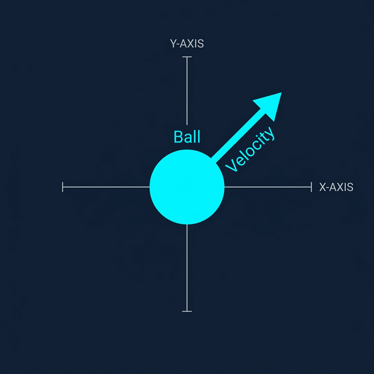
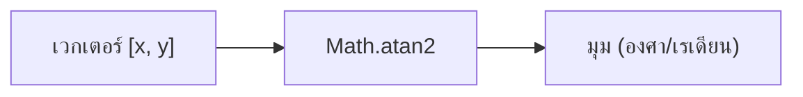
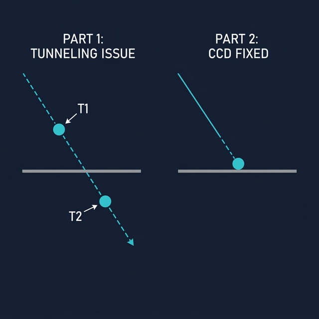
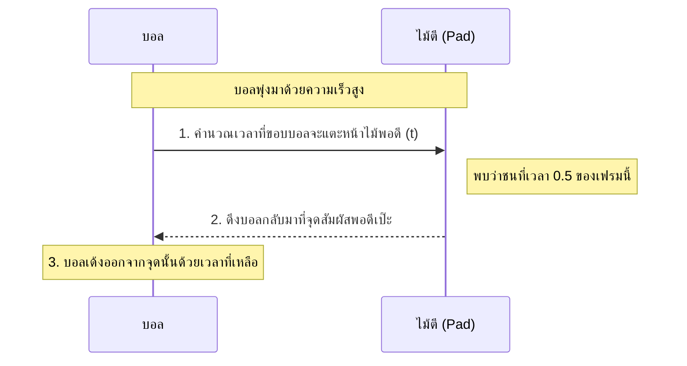
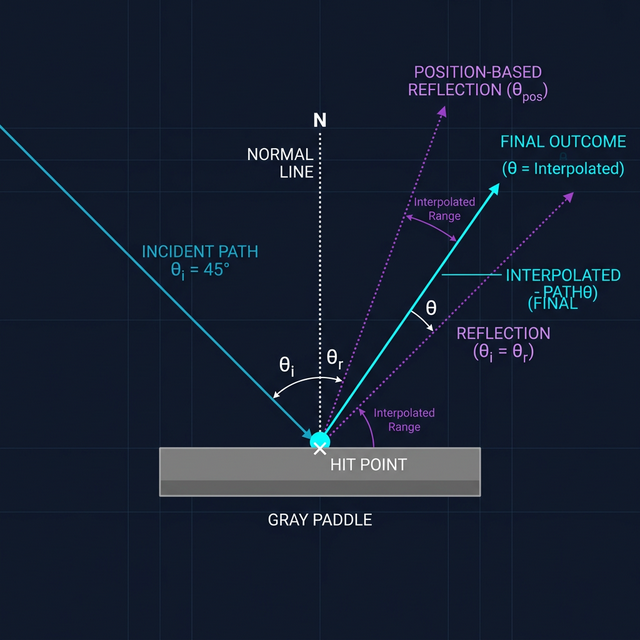
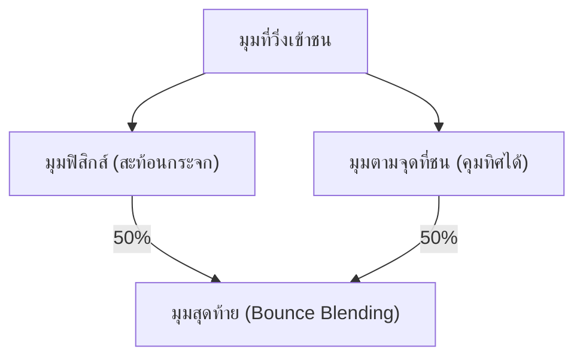

# 🎾 เจาะลึกระบบฟิสิกส์และคณิตศาสตร์ในเกม Pong (Deep Dive Physics & Math)

เอกสารฉบับนี้ออกแบบมาเพื่อเป็นคู่มือการศึกษา (Tutorial) ที่อธิบายเบื้องหลังการคำนวณของเกม Pong โดยละเอียด ตั้งแต่เวกเตอร์พื้นฐานไปจนถึงลอจิกการชนขั้นสูง โดยเน้นการใช้ภาพประกอบและคำบรรยายเพื่อให้เห็นภาพชัดเจน แม้ไม่มีพื้นฐานด้านคณิตศาสตร์เข้มข้น

---

## 1. เวกเตอร์และการเคลื่อนที่ (Vectors & Movement)

ในเกม 2D วัตถุทุกอย่างถูกบอกตำแหน่งด้วยพิกัด $(x, y)$ บนระนาบ เหมือนการระบุตำแหน่งบนแผนที่

### พิกัดและความเร็ว (Coordinates & Velocity)

ลูกบอลมีตัวแปรสำคัญคือ `position` (ตำแหน่งปัจจุบัน) และ `velocity` (ความเร็วและทิศทาง)

- **Vector (เวกเตอร์)**: นึกภาพว่ามันคือ **"ลูกศร"** ที่ชี้ไปในทิศทางต่าง ๆ ความยาวของลูกศรคือความแรง (Speed) และหัวลูกศรคือทิศทาง
- **การอัปเดตตำแหน่ง**: ในทุก ๆ เฟรม เราจะขยับตำแหน่งบอลไปตาม "ลูกศรความเร็ว" นั้น
  $$Pos_{new} = Pos_{old} + (Velocity \times dt)$$

> [!TIP]
> **ภาพจำเรื่อง $dt$ (Delta Time)**:
> ลองนึกภาพ "การเปิดไฟกะพริบ" ถ้าเรากะพริบตาถี่ ๆ (High FPS) เราจะเห็นบอลขยับทีละนิด แต่ถ้ากะพริบตาช้าลง (Low FPS) บอลต้องกระโดดไกลขึ้นเพื่อให้ไปถึงเป้าหมายในเวลาที่เท่ากัน การคูณ $dt$ คือการบอกบอลว่า "เนื่องจากครั้งนี้เรากะพริบตาช้า (dt เยอะ) เจ้าต้องกระโดดไกลขึ้นนะ" เพื่อให้ความเร็วดูสม่ำเสมอนั่นเอง

---

## 2. ตรีโกณมิติ: การสลับระหว่างทิศทางและพลัง (Trigonometry)

คอมพิวเตอร์เข้าใจความเร็วแบบ $[x, y]$ (เดินไปข้างกี่ก้าว ขึ้นบนกี่ก้าว) แต่เราเข้าใจแบบ "มุม" และ "ความแรง"

### จาก $[x, y]$ เป็น มุม (Angle)

เราใช้ฟังก์ชัน `Math.atan2(y, x)` เพื่อแปลงค่าพิกัดให้กลายเป็นองศา

### จาก มุม (Angle) เป็น $[x, y]$

นึกภาพ **"หน้าปัดนาฬิกา"**: เมื่อเราเข็มนาฬิกาชี้ไปที่มุมหนึ่ง (Angle) ปลายเข็มจะบอกเราว่าต้องเดินไปทางขวาเท่าไหร่ ($x$) และขึ้นบนเท่าไหร่ ($y$)

- **$\sin$ (Sine)**: บอกว่าเราต้องไป **"ซ้ายหรือขวา"** เท่าไหร่
- **$\cos$ (Cosine)**: บอกว่าเราต้องไป **"บนหรือล่าง"** เท่าไหร่
  $$V_x = Speed \times \sin(\theta)$$
  $$V_y = Speed \times \cos(\theta)$$

---

## 3. การชนไม้ตีขั้นสูง: CCD (Continuous Collision Detection)

ปัญหาใหญ่คือ **"Tunneling"** หรือการที่บอลวิ่งเร็วมากจน "วาร์ป" ข้ามไม้ตีไปในหนึ่งเฟรม

### ภาพเปรียบเทียบ: Discrete vs Continuous

- **แบบทั่วไป (Discrete)**: เหมือนการถ่ายรูปสติ๊กเกอร์ทีละใบ ใบแรกบอลอยู่หน้าไม้ ใบที่สองบอลอยู่หลังไม้ไปแล้ว → **ตรวจไม่เจอว่าชน**
- **แบบต่อเนื่อง (CCD)**: เหมือนการลากเส้นยาว ๆ ตามทางที่บอลวิ่ง แล้วดูว่าเส้นนั้น **"ตัดผ่าน"** หน้าไม้หรือไม่

---

## 4. การผสมมุมสะท้อน (Bounce Blending & LERP)

นี่คือการผสมผสานระหว่าง **"ความจริง"** กับ **"ความสนุก"**

### ภาพจำของการผสมมุม

นึกภาพว่ามี "คนสองคน" กำลังแย่งกันดึงหางเสือเรือ:

1.  **นายฟิสิกส์ (Physics)**: "เด้งออกด้วยมุมเดียวกับที่เข้าชนสิ!" (เหมือนกระจก)
2.  **นายอาร์คานอยด์ (Arkanoid)**: "เด้งไปตามจุดที่ชนบนไม้สิ! (ชนขวา-เด้งขวา, ชนซ้าย-เด้งซ้าย)"

การใช้ `BOUNCE_BLEND_FACTOR` คือการเลือกว่าจะเชื่อใครกี่เปอร์เซ็นต์ ทำให้บอลดูไม่เด้งหลอกตาเกินไป แต่ผู้เล่นยัง "ตบ" บอลเปลี่ยนทิศทางได้ตามใจสั่ง

---

## 5. การกลับมุมมอง (Coordinate Inversion)

เพื่อให้ผู้เล่นทั้งสองฝั่งรู้สึกว่าตัวเองอยู่ **"ด้านล่าง"** เสมอ เราต้องทำการ "กลับโลก" ให้ผู้เล่นคนที่สอง

### ภาพจำ: การมองกระจก

นึกภาพสนามแข่งที่มีเส้นกึ่งกลางเป็นกระจกเงา:

- เมื่อบอลอยู่ที่มุม **ล่างขวา** ของสนามจริง
- ผู้เล่นอีกฝั่งจะมองเห็นบอลลูกเดียวกันอยู่ที่มุม **บนซ้าย** ของจอตัวเอง

**สูตรการกลับด้าน:**

- $X_{render} = Arena_{Width} - X_{server}$
- $Y_{render} = Arena_{Height} - Y_{server}$

---

### 📝 คำศัพท์และเชิงอรรถ (Glossary & Footnotes)

[^1]: **Vector magnitude**: ความยาวของเวกเตอร์ ในที่นี้คือ "Speed" หรืออัตราเร็วของลูกบอล คำนวณจาก $\sqrt{V_x^2 + V_y^2}$ (ทฤษฎีบทพีทาโกรัส)

[^2]: **Radians vs Degrees**: คอมพิวเตอร์ส่วนใหญ่คำนวณมุมในหน่วย **เรเดียน** (3.14 หรือ $\pi$ มีค่าเท่ากับ 180 องศา)

[^3]: **LERP**: ย่อมาจาก Linear Interpolation เป็นพื้นฐานสำคัญในกราฟิกเกม ใช้สำหรับทุกอย่างตั้งแต่การผสมสี ไปจนถึงการเคลื่อนไหวที่นุ่มนวล
