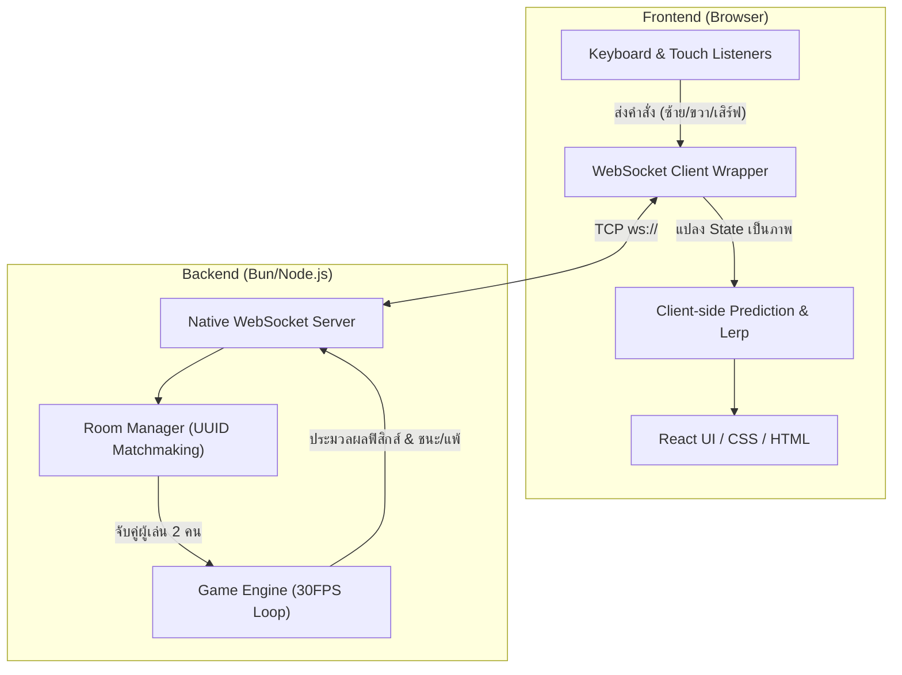
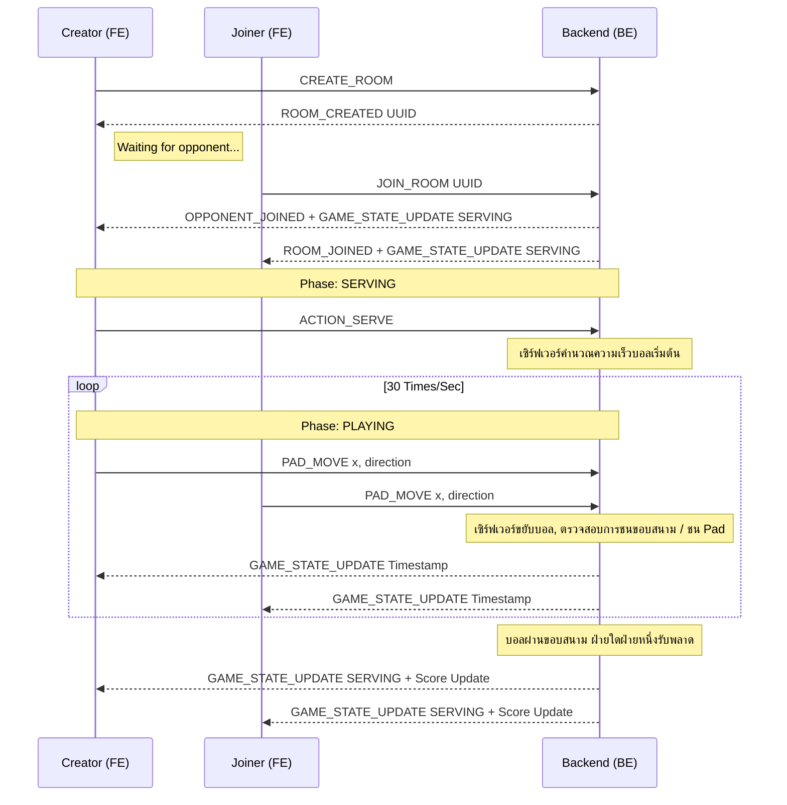

# Pong 1v1 Online: เอกสารสถาปัตยกรรมและระบบการทำงาน (Technical Flow)

เอกสารฉบับนี้จัดทำขึ้นเพื่อเป็น **Project Study** สำหรับนักพัฒนาซอฟต์แวร์ที่ต้องการศึกษาและทำความเข้าใจการออกแบบระบบเกม Multiplayer แบบ Real-time บนเบราว์เซอร์ โดยใช้เทคโนโลยี WebSockets ผ่านสถาปัตยกรรม Authoritative Server

---

## 🏗️ 1. ภาพรวมสถาปัตยกรรม (Architecture Overview)

โปรเจกต์นี้แบ่งออกเป็น 3 ส่วนหลัก (Workspace) ที่ทำงานสอดประสานกันภายใต้โครงสร้าง Monorepo:

1. **`pong-shared`**: คลังข้อมูลกลาง (Single Source of Truth) จัดเก็บกฎของเกม, โครงสร้างข้อมูล (`Types`) และชื่อ Event (`Enums/Constants`) เพื่อให้ Frontend และ Backend ใช้ข้อมูลชุดเดียวกันอย่างสมบูรณ์
2. **`pong-be` (Backend - The Authoritative Server)**: ส่วนประมวลผลหลักของระบบ เขียนด้วย Node.js/Bun บน Express และโมดูล `ws` รับผิดชอบการรัน "Game Engine" ตรวจสอบฟิสิกส์, การชน และป้องกันการทุจริต (Anti-Cheat)
3. **`pong-fe` (Frontend - The Dumb Client)**: ส่วนแสดงผลเขียนด้วย React + Vite ทำหน้าที่รับสถานะเกมจากเซิร์ฟเวอร์มาแสดงผล (Rendering) อย่างลื่นไหล และส่งข้อมูล Input ของผู้เล่นกลับไปให้เซิร์ฟเวอร์ประมวลผล

### แผนภาพสถาปัตยกรรม

---

## 🔄 2. วงจรเวลาและอัตราการอัปเดต (The Game Loop Definition)

องค์ประกอบสำคัญของเกม Real-time คือกรอบเวลา (Tick Rate) ระบบนี้ออกแบบด้วยแนวคิดกึ่ง Real-time เพื่อจัดสมดุลระหว่างประสิทธิภาพและทรัพยากร:

- **Server Tick Rate (30 FPS)**: `GameEngine.ts` ประมวลผลตำแหน่งลูกบอลและ Pad ทุก `33.33ms`
- **Client Frame Rate (60 FPS ขึ้นไป)**: เบราว์เซอร์ใช้อัตราเฟรมตามความสามารถของหน้าจอ (ผ่าน `requestAnimationFrame` หรือ React State Updates) เพื่ออัปเดตกราฟิกอย่างลื่นไหล

---

## 🎮 3. ลำดับเหตุการณ์และสถานะเกม (Event Flow & Game Phases)

วงจรของเกมแบ่งออกเป็น 5 สถานะหลัก (Game Phase):

1. **`WAITING_FOR_OPPONENT`**: ผู้สร้างห้อง (CREATOR) ได้รับ UUID เซิร์ฟเวอร์จัดสรรทรัพยากรสำหรับห้องใหม่ แต่ยังไม่เริ่ม Game Loop จนกว่า JOINER จะเชื่อมต่อเข้ามา
2. **`SERVING`**: ลูกบอลหยุดนิ่งและติดอยู่กับ Pad ของผู้มีสิทธิ์เสิร์ฟ รอรับ Event `ACTION_SERVE` จาก Client
3. **`PLAYING`**: Game Engine วนประมวลผลตรวจจับการชน (Pad Collision & Bounce Angles), ขอบสนาม และรับ Event `ACTION_POWER_HIT`
4. **`PAUSED_DISCONNECT`**: หากสัญญาณ WebSocket หลุด เซิร์ฟเวอร์จะระงับ Game Loop และเริ่มนับเวลา Grace Period (60 วินาที) พร้อมแจ้งสถานะการหยุดชั่วคราวแก่ผู้เล่นทั้งสองฝ่าย
5. **`GAME_OVER`**: เกมสิ้นสุดเมื่อหมดเวลา Reconnect หรือเข้าเงื่อนไขจบเกม เซิร์ฟเวอร์ประกาศผลและดำเนินการ Cleanup ทรัพยากรของห้อง

### แผนภาพลำดับขั้นตอนการเล่น

---

## 🛠️ 4. หลักการออกแบบที่น่าสนใจในโปรเจกต์นี้

- **Perspective Inversion (การกลับทิศทางมุมมอง)**

  เกม Pong แนวตั้งมีปัญหาหลักด้านพิกัดเมื่อผู้เล่นสองฝ่ายมีมุมมองตรงข้ามกัน
  - *ปัญหา*: Player 2 (Joiner) จะมองตัวละครของตนอยู่ด้านบน และปุ่มซ้าย-ขวาสลับทิศกัน
  - *วิธีแก้ไข*: เซิร์ฟเวอร์คำนวณพิกัดตามแนวแกนปกติ แต่ฝั่ง React (`Arena.tsx`) ของ Joiner จะแปลงพิกัดด้วยการคูณ `-1` หรือ `MAX_HEIGHT - y` เพื่อกลับทิศแสดงผล ทำให้ผู้เล่นทั้งสองฝ่ายรับรู้ว่าตนเองอยู่ "ด้านล่างของสนาม" เสมอ โดยไม่เพิ่มความซับซ้อนในโค้ดเซิร์ฟเวอร์

- **Optimistic UI Constraints**

  เมื่อผู้เล่นกดเลื่อน Pad Client จะขยับ Pad ในหน้าจอทันที (Optimistic Update) โดยไม่รอการยืนยันจากเซิร์ฟเวอร์ เพื่อให้การตอบสนองลื่นไหลและไม่มีความล่าช้า อย่างไรก็ตาม Client ต้องคำนวณขอบเขตสนาม (Clamp Bounds) ให้ตรงกับเซิร์ฟเวอร์ เพื่อป้องกันไม่ให้ Pad เคลื่อนที่เกินขอบสนาม

- **Power Hit Geometry (คณิตศาสตร์ของ Power Hit)**

  มุมสะท้อนตาม Arkanoid-bounce Logic ขึ้นอยู่กับระยะห่างแนวนอน (Distance X) ระหว่างจุดกึ่งกลาง Pad กับจุดกึ่งกลางลูกบอล กล่าวคือ ยิ่งลูกกระทบใกล้ขอบ Pad มุมสะท้อนยิ่งกว้างมากขึ้น (ในช่วง -45 ถึง +45 องศา)

  เมื่อผู้เล่นกด Power Hit เซิร์ฟเวอร์จะบีบมุมสะท้อนให้แคบลงครึ่งหนึ่ง และเพิ่มความเร็วลูกบอลขึ้น 2 เท่า ทำให้ลูกพุ่งตรงดิ่งและรวดเร็ว เพิ่มความเข้มข้นในการแข่งขัน
